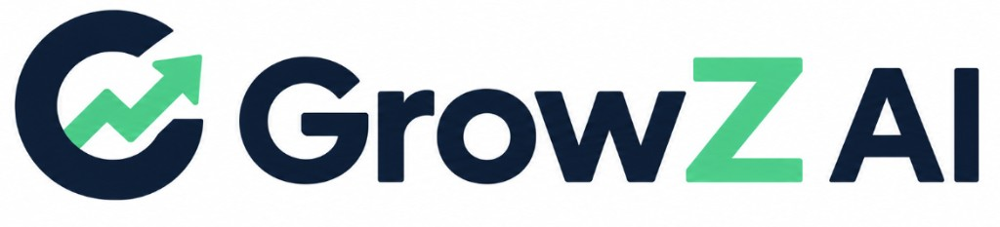

# GrowZ AI

> Stop scrolling, start knowing. GrowZ AI turns every stock name you read
> into a live price, a chart, and an AI-picked headline — instantly.

A Manifest V3 Chrome extension that scans a curated list of Indian financial
news sites, highlights recognized NSE/BSE company names, shows a lightweight
hover popup with LTP/day change, and opens an in-page expanded panel with a
self-hosted candlestick chart (via `lightweight-charts`) plus Market
Cap/Analyst Rating when you click "View Chart".

See the build plan this implements for full context on product decisions.

## Setup

```bash
npm install
npm run build          # one-off build -> dist/
npm run watch          # rebuild on file changes
npm run typecheck      # tsc --noEmit
npm test               # matching/gating acceptance tests (offline)
npm run verify:indices # re-check index symbols against Yahoo + TradingView (network)
```

## Load into Chrome

1. Run `npm run build` (produces `dist/background.js`, `dist/content.js`, `dist/manifest.json`).
2. Open `chrome://extensions` in Chrome.
3. Enable **Developer mode** (top-right toggle).
4. Click **Load unpacked** and select the `dist/` folder.
5. Visit one of the curated sites below and hover over a highlighted company name in an article.

## Curated sites (v1)

Economic Times, Moneycontrol, LiveMint, Business Standard, CNBC-TV18,
Financial Express, NDTV Profit, Business Today, The Hindu BusinessLine,
Zee Business, BQ Prime, Reuters India. Edit `content_scripts.matches` in
`manifest.json` to add/remove sites.

## Expanding the company dictionary

`src/data/companies.json` ships with a hand-seeded list (Nifty 50 + a few
extras) so the extension works out of the box. To regenerate/expand it from
the full NSE listed-equity universe:

1. Download the "Equity List" CSV from NSE's website (Markets > Securities
   Available for Trading > Equity List).
2. Add any short-form aliases that can't be auto-derived (e.g. "Infy", "HUL")
   to `scripts/manualAliases.json`.
3. Run:
   ```bash
   npm run build:dictionary -- path/to/nse-equity-list.csv
   ```
   This overwrites `src/data/companies.json`.
4. Re-run `npm run build`.

## Indices

Market indices (Nifty 50, Bank Nifty, Sensex, the sectoral Niftys, India VIX)
live in `src/data/indices.json`, **not** `companies.json` — the dictionary
rebuild above overwrites that file wholesale, so anything hand-added there
would be lost. The scanner concatenates the two at load time.

Index symbols can't be derived from the name the way an equity's can
(`${ticker}.NS`). Yahoo's Indian index coverage is uneven, its legacy `^CNX*`
symbols don't track NSE's current branding, and at least one symbol is
actively misleading: `^NSMIDCP` reads like a midcap index but is Nifty Next
50. Several plausible symbols also return a live quote with almost no
history, which renders an empty chart. Both failures look like success in the
UI, so every symbol is checked against the live endpoints:

```bash
npm run verify:indices
```

It fails any entry whose Yahoo symbol returns a sparse 6-month series or
whose TradingView slug 404s/redirects, and prints Yahoo's own `shortName` so
a symbol pointing at the wrong index is visible on inspection. Run it before
adding an index and whenever charts start looking wrong.

Entries carry `kind: "index"`, which suppresses the analyst-data fetch (the
`financialData` quoteSummary module doesn't exist for indices), hides the
Market Cap / Analyst KPI row, and drops the rupee symbol — an index level
isn't a currency amount.

## Architecture

- `src/content/scanner.ts` — walks DOM text nodes, matches against the
  merged equity + index dictionary, applies context-clue disambiguation for
  ambiguous names (`src/content/disambiguation.ts`,
  `src/data/ambiguousBlocklist.json`), and wraps matches in highlighted
  `<span>`s. A debounced `MutationObserver` handles dynamically loaded
  content. The pure matching pass is exported as `findMatchesInText` so
  `npm test` can exercise it without a DOM.
- Disambiguation has three layers. Entry-level: tickers in
  `ambiguousBlocklist.json` need a financial keyword nearby. Alias-level: an
  entry's `gated` array marks individual names that are too generic on their
  own (bare "Nifty" is gated; "Nifty 50" isn't). Venue-level: "BSE", "NSE",
  and their expansions name both a listed company and the exchange
  everything else trades on, so "listed on the BSE" and "BSE-listed" are
  rejected while "BSE shares rose" is kept. Note that the keyword scan
  excludes the matched text itself — "Nifty" and "BSE" are both financial
  keywords, and left in they would satisfy their own gate.
- `src/content/components/MiniPopup.ts` — Shadow DOM hover popup: ticker,
  name, LTP, day change, and a "View Chart" button (only the button is
  clickable). No chart is loaded here.
- `src/content/components/ExpandedPanel.ts` — Shadow DOM overlay panel,
  docked to the right edge, full height. Shows LTP/day change, Market Cap,
  Analyst Rating, and a self-hosted candlestick chart (rendered on a
  `<canvas>` via the bundled `lightweight-charts` library, fed by candles
  from `GET_CHART_DATA`) for a single company, plus a small outbound link to
  view the full interactive chart on TradingView. Updates in place if a
  different company is hovered while open.
- `src/background/service-worker.ts` — routes `GET_QUOTE` messages to
  `yahooFinanceClient.ts` and `GET_CHART_DATA` messages to
  `yahooChartClient.ts` (both Yahoo Finance's unofficial endpoints — quote
  and `v8/finance/chart` respectively), each through its own TTL cache
  (`cache.ts`'s `createTtlCache` factory: 5 min for quotes, 15 min for
  chart candles). Runs in the background worker so `host_permissions`
  bypasses the host page's CORS restrictions.

## Known risks / manual verification still needed

These require an actual Chrome session and can't be automated from this
environment — please verify them yourself before relying on the extension day-to-day:

1. **Yahoo Finance's unofficial endpoints** (`v7/finance/quote`,
   `v10/finance/quoteSummary`, and now `v8/finance/chart` for candle data)
   can change, rate-limit, or require a fresh crumb/cookie handshake without
   notice. If quotes or the chart stop loading, check the background service
   worker's console (`chrome://extensions` -> the extension -> "service
   worker" link) for fetch errors.
2. **Highlight accuracy / false positives** on the ambiguous names in
   `ambiguousBlocklist.json` (Titan, Page Industries, Route Mobile,
   Persistent Systems, Force Motors, Star Health, Trent) should be spot
   checked on real articles and tuned (add/remove context keywords) as
   needed. `npm test` covers the index and BSE-venue cases but not these.
   Note the blocklist is still only a handful of tickers while the
   dictionary holds ~247 single-token aliases, so common-word names beyond
   this list (e.g. "Premier", "Eternal", "Kaya") are currently ungated.
3. Verify multiple mentions of the same company in one article all highlight
   and behave consistently, and that hover/panel positioning looks right near
   the edges of the screen.
4. Verify the chart on each of the 12 curated sites: it renders via a
   self-hosted `<canvas>` (the `lightweight-charts` library, bundled into
   `content.js`) rather than a third-party iframe, so it is no longer subject
   to the host page's `script-src`/`frame-src` CSP — this was the root cause
   of the chart rendering blank on some sites under the earlier TradingView
   embed approach, and is now structurally eliminated. Still worth checking
   that the chart resizes correctly when the panel/viewport changes size and
   that switching between companies while the panel is open swaps the chart
   data cleanly.

## Out of scope for v1

Options/settings page, toolbar UI, disclaimers, a "Mentions" list of all
companies on a page, Buy/Sell actions, backend server, paid data APIs, and
markets outside India.
